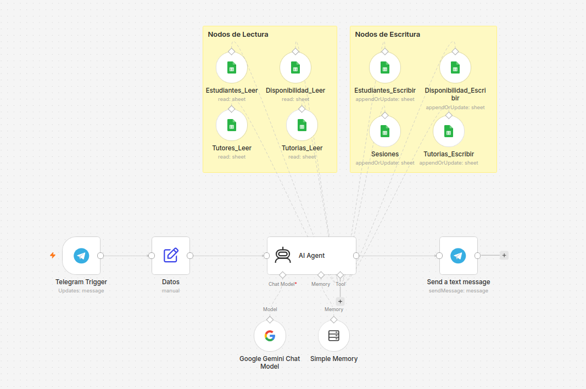
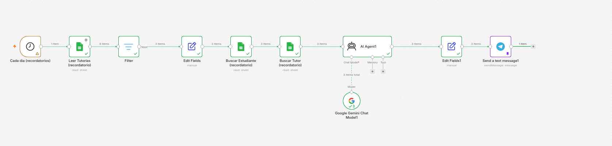

# Sistema de Asosorías Academicas con N8N

Sistema de gestión y automatización de tutorías estudiantiles integrado con Telegram, Google Sheets y el modelo de inteligencia artificial Google Gemini a través de n8n. El proyecto permite a los estudiantes consultar disponibilidad, agendar tutorías, consultar información de tutores y recibir recordatorios automáticos programados.

## 🚀 Características Principales

- Atención Conversacional por Telegram: Agente con IA capaz de comprender lenguaje natural y resolver consultas en tiempo real.

- Integración Bidireccional con Google Sheets: Lectura y actualización dinámica de estudiantes, tutores, tutorías, disponibilidad y sesiones.

- Memoria Contextual de Conversación: Mantenimiento de la continuidad en la interacción por usuario mediante Simple Memory.

- Notificaciones y Recordatorios Programados: Flujo cronometrado ejecutable a diario para enviar recordatorios personalizados sobre tutorías pendientes a estudiantes y tutores.

## ⚙️ Arquitectura de los Flujos de Trabajo

**Nodos de ingreso de datos**



Se hicieron dos bloques de google sheets ya que un bloque ayuda al agente de IA a revisar los datos y leerlos, mientras el otro bloque ayuda al agente a escribir los datos recibidos por el usuario


**Nodos para recordatorios**




## Página web

Se agrego una página web donde el usuario puede tener un acceso directo al chatbot

## 📁 Estructura del Proyecto

```text
SISTEMA-DE-ASESORIAS-ACADEMICAS/
│
├── 📂 css/
│   ├── layout.css             # Estilos para la estructura y maquetación (grid, flexbox, nav, footer)
│   └── style.css              # Estilos generales, colores, fuentes y componentes visuales
│
├── 📂 img/
│   ├── imagenProfesores.jpeg  # Imagen principal de presentación de los tutores
│   ├── nodos_ingresoDatos.png # Diagrama del flujo de ingreso de datos en n8n
│   └── nodos_recordatorios.png# Diagrama del flujo de recordatorios automáticos en n8n
│
├── 📂 js/
│   └── app.js                 # Lógica principal de JavaScript (interacción de interfaz, scripts)
│
├── 📂 json/
│   └── AcademicTouring.json   # Exportación/Backup de las configuraciones del flujo de n8n
│
├── index.html                 # Página de inicio del sistema y presentación del servicio
└── README.md                  # Documentación principal del repositorio


## 👨 AUTOR
Programador Full-Stack Jr. Alan Gomez

GitHub: [AlanGomez-Programmer](https://github.com/AlanGomez-Programmer)

Linkedln: alan-gomez-763163320