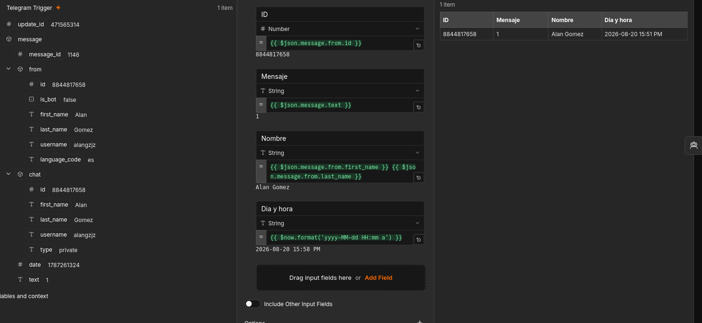
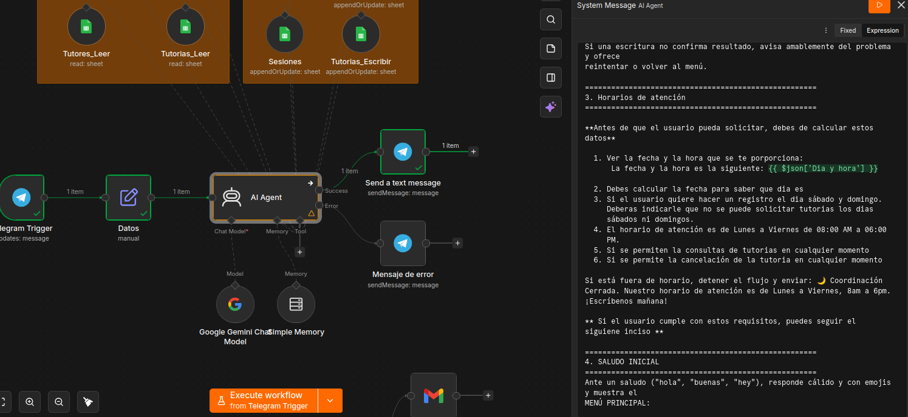

# Sistema de Asosorías Academicas con N8N

Sistema de gestión y automatización de tutorías estudiantiles integrado con Telegram, Google Sheets y el modelo de inteligencia artificial Google Gemini a través de n8n. El proyecto permite a los estudiantes consultar disponibilidad, agendar tutorías, consultar información de tutores y recibir recordatorios automáticos programados.

## 🚀 Características Principales

- Atención Conversacional por Telegram: Agente con IA capaz de comprender lenguaje natural y resolver consultas en tiempo real.

- Integración Bidireccional con Google Sheets: Lectura y actualización dinámica de estudiantes, tutores, tutorías, disponibilidad y sesiones.

- Memoria Contextual de Conversación: Mantenimiento de la continuidad en la interacción por usuario mediante Simple Memory.

- Notificaciones y Recordatorios Programados: Flujo cronometrado ejecutable a diario para enviar recordatorios personalizados sobre tutorías pendientes a estudiantes y tutores.

## ⚙️ Arquitectura de los Flujos de Trabajo

**Nodos de ingreso de datos**


Se hicieron dos bloques de google sheets ya que un bloque ayuda al agente de IA a revisar los datos y leerlos, mientras el otro bloque ayuda al agente a escribir los datos recibidos por el usuario


**Nodos para recordatorios**


## 🔄 Actualizaciones

1. **Horario de atención:** 
    
    Se agrega un nuevo nodo para que los usuarios tengan un el horario de atención. 
    
    - Lunes a Viernes de 08:00 AM a 06:00 PM. 
    - Sabados y domingos en usuario puede hacer consultas sobre sus tutorias y podrá cancelar tutorias.


**¿Qué hay de nuevo?**

1. **Intregraciòn de fecha y hora en el nodo de filtro**

    Para integrar esta actualización, se agrego en el filtro la fecha y la hora 

    

    En el bloque Fecha y hora se agrego el siguiene código:

    ```bash

        {{ $now.format('yyyy-MM-dd HH:mm a') }} // .format() indica el formate que se desa

    ```

2. **Se modificó el prompt**
    
    En el prompt del agente de IA se agrego un nuevo inciso, modificando la numerión. 
    
    El inciso donde se agrega el nuevo prompt es el inciso 3.

    **prompt**
    
    ```text
    =====================================================
    3. Horarios de atención
    =====================================================

    **Antes de que el usuario pueda solicitar, debes de calcular estos datos**

    1. Ver la fecha y la hora que se te porporciona: 
        La fecha y la hora es la siguiente: {{ $json['Dia y hora'] }}

    2. Debes calcular la fecha para saber que dia es
    3. Si el usuario quiere hacer un registro el dia sábado y domingo.
        Deberas indicarle que no se puede solicitar tutorias los dias
        sábados ni domingos.
    4. El horario de atención es de Lunes a Viernes de 08:00 AM a 06:00
        PM.
    5. Si se permiten la consultas de tutorias en cualquier momento
    6. Si se permite la cancelación de la tutoria en cualquier momento

    Si está fuera de horario, detener el flujo y enviar: 🌙 Coordinación Cerrada. Nuestro horario de atención es de Lunes a Viernes, 8am a 6pm. ¡Escríbenos mañana!

    ** Si el usuario cumple con estos requisitos, puedes seguir el siguiene inciso **
    ```

    Se le es especifica el agente que realizar y de donde debe tomar los datos

    


## Página web

Se agrego una página web donde el usuario puede tener un acceso directo al chatbot

## 📁 Estructura del Proyecto

```text
SISTEMA-DE-ASESORIAS-ACADEMICAS/
│
├── 📂 css/
│   ├── layout.css             # Estilos para la estructura y maquetación (grid, flexbox, nav, footer)
│   └── style.css              # Estilos generales, colores, fuentes y componentes visuales
│
├── 📂 img/
│   ├── imagenProfesores.jpeg  # Imagen principal de presentación de los tutores
│   ├── nodos_ingresoDatos.png # Diagrama del flujo de ingreso de datos en n8n
│   └── nodos_recordatorios.png# Diagrama del flujo de recordatorios automáticos en n8n
│
├── 📂 js/
│   └── app.js                 # Lógica principal de JavaScript (interacción de interfaz, scripts)
│
├── 📂 json/
│   └── AcademicTouring.json   # Exportación/Backup de las configuraciones del flujo de n8n
│
├── index.html                 # Página de inicio del sistema y presentación del servicio
└── README.md                  # Documentación principal del repositorio
```


## 👨 AUTOR
Programador Full-Stack Jr. Alan Gomez

GitHub: [AlanGomez-Programmer](https://github.com/AlanGomez-Programmer)

Linkedln: alan-gomez-763163320